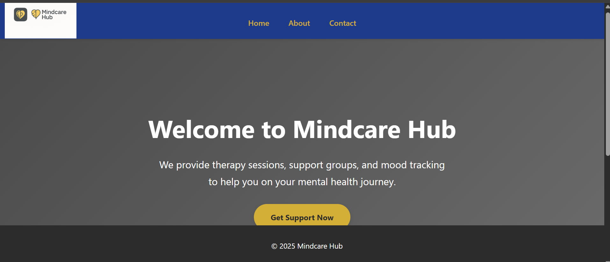
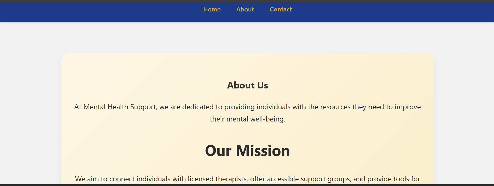
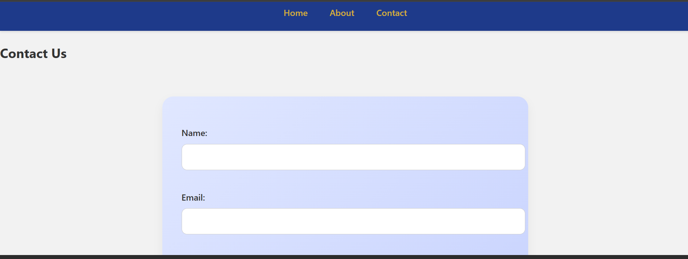

# **Mindcare Hub - Final Project & Deployment**

## **Project Overview**

The **Mindcare Hub** website is designed as a mental health support platform that offers resources for therapy, support groups, and mood tracking. The website features three main pages:

* **Home**: Introduction to the platform, services, and a call-to-action to get involved.
* **About**: Information about the platform, its mission, and goals.
* **Contact**: A form where users can reach out for more information or support.

The website is responsive and designed to provide a clean, accessible interface that helps users navigate the resources easily.

## **Features**

* **Responsive Design**: The website adjusts to different screen sizes and devices for a smooth user experience on both desktop and mobile devices.
* **Interactive Elements**: Includes a contact form with validation and a call-to-action button.
* **Modern Styling**: Utilizes CSS3 for visually appealing layouts, and JavaScript for form validation and interactivity.

## **Technologies Used**

* **HTML5**: For semantic structure and content organization.
* **CSS3**: For styling the pages and ensuring a responsive layout.
* **JavaScript**: For adding interactivity such as form validation.
* **GitHub Pages**: For deploying the website to a live environment.

## **Project Installation and Setup**

1. **Clone the Repository**
   Clone this repository to your local machine:

   ```bash
   git clone https://github.com/elinah254/feb-2025-final-project-and-deployment-elinah254.git
   ```

2. **Navigate to the Project Folder**

   ```bash
   cd feb-2025-final-project-and-deployment-elinah254
   ```

3. **Open the Project in Your Browser**
   Open `index.html` in your preferred web browser to view the website.

## **Deployment**

The website has been deployed to GitHub Pages. You can view the live website here:

[Mindcare Hub](https://elinah254.github.io/feb-2025-final-project-and-deployment-elinah254/)

## **Project Files**

* **HTML**: Contains the structure and content for each page (Home, About, Contact).

  * `index.html` (Home)
  * `about.html` (About)
  * `contact.html` (Contact)

* **CSS**: Styling for the pages, including layout, color scheme, and responsiveness.

  * `styles.css`

* **JavaScript**: Interactivity, including form validation on the Contact page.

  * `scripts.js`

* **Images**: Includes images for logos, favicons, and any other assets.

  * `logo.png`
  * `favicon.ico`

## **Screenshots**







## **Contributing**

1. Fork the repository.
2. Create a new branch (`git checkout -b feature-name`).
3. Commit your changes (`git commit -m 'Add feature'`).
4. Push to the branch (`git push origin feature-name`).
5. Create a new pull request.

# Author
Elinah Mmbone
